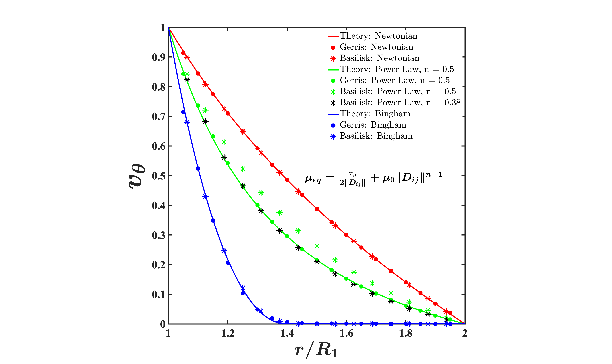

# RotatingCouette
This repository contains the implementation of Viscoplastic viscosity in Basilisk C. Trying to simulate the test case from Gerris: http://gerris.dalembert.upmc.fr/gerris/tests/tests/couette.html

To implement the boundary condition for the rotating cylinder, the method of embedded boundaries is used (http://basilisk.fr/src/embed.h). 

The results match the theoretical and Gerris simulations for Newtonian fluids and Bingham fluids, but there is variation for shear thinning (Power Law) fluid (n = 0.5) 

The result for the current simulation:

  

